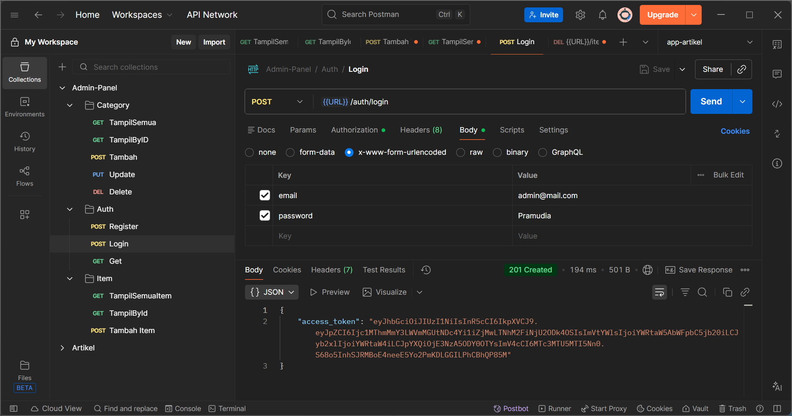
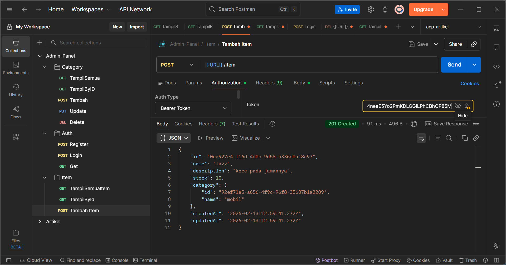
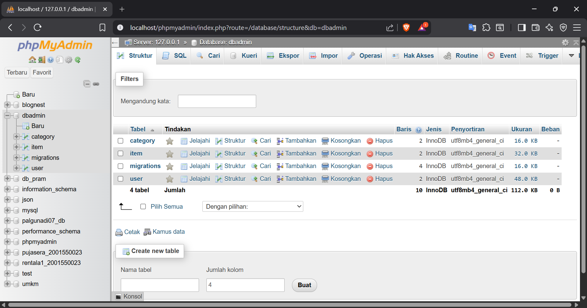
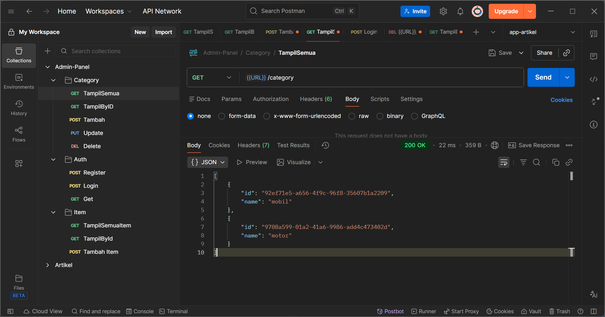
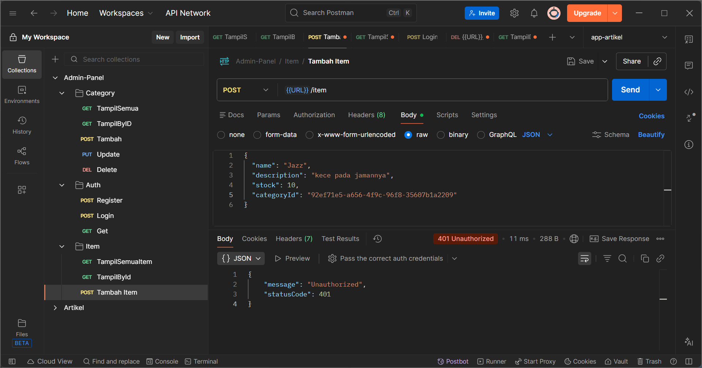

<p align="center">
  <a href="http://nestjs.com/" target="blank"></a>
</p>

<p align="center">
  
  <h1 align="center">Web Admin Panel - Inventory System</h1>
</p>

## 👤 Identitas Mahasiswa
* **Nama:** Irgi Pramudia
* **Program Studi:** Teknik Informatika
* **Instansi:** Universitas Semarang (USM)

## 📝 Description Project

Proyek ini adalah sistem Backend API untuk manajemen inventaris barang yang dirancang menggunakan framework NestJS. Fokus utama pengembangan ini adalah mengelola hubungan data relasional antara Category dan Item menggunakan skema One-to-Many, di mana setiap kategori dapat menaungi berbagai item produk secara terorganisir.

Aplikasi ini mengimplementasikan keamanan tingkat lanjut dengan JWT (JSON Web Token) untuk memastikan bahwa operasi sensitif seperti pembuatan, pembaruan, dan penghapusan data hanya dapat dilakukan oleh pengguna yang terautentikasi.

## 🔄 Technical Workflow

 Alur kerja aplikasi mengikuti pola Modular & Layered Architecture dengan urutan sebagai berikut:

 Request Layer: Client mengirim data melalui Postman (misal: Menambah Item baru) dengan menyertakan JWT di Header.

 Security Layer: AuthGuard memverifikasi token. Jika valid, request diteruskan ke Controller.

 Validation Layer: CreateItemDto memeriksa apakah tipe data sudah sesuai (misal: stock harus number dan tidak boleh negatif).

 Business Logic Layer: ItemService mencari keberadaan Category berdasarkan categoryId. Jika kategori tidak ditemukan, sistem melempar NotFoundException.

 Persistence Layer: Data yang sudah valid disimpan ke database MySQL melalui TypeORM Repository.

 Migration Layer: Perubahan struktur tabel dicatat secara historis melalui file migrasi untuk menjaga integritas database di masa depan.

## 🛠️ Fitur Utama & Keunggulan

Secure Authentication: Registrasi dan login dengan enkripsi password menggunakan teknologi JWT.

Relational Integrity: Penggunaan Foreign Key yang memastikan setiap item wajib memiliki kategori yang valid.

Modular Design: Kode terorganisir per fitur (Module), memudahkan pemeliharaan dan skalabilitas aplikasi.

Database Versioning: Implementasi Migrations untuk sinkronisasi skema database antar lingkungan pengembangan.

## 📸 Bukti Fungsionalitas Aplikasi

| 1. Login & JWT Auth | 2. Create Item (Relasi) |
| :---: | :---: |
|  |  |
| *Sukses mendapatkan Token* | *Input categoryId valid* |

| 3. Struktur Database | 4. Get All Category |
| :---: | :---: |
|  |  |
| *Tabel hasil migrasi* | *Response data kategori* |

> **Catatan:** Sistem juga menangani error akses tanpa token (401 Unauthorized).
> 

[circleci-image]: https://img.shields.io/circleci/build/github/nestjs/nest/master?token=abc123def456
[circleci-url]: https://circleci.com/gh/nestjs/nest

  <p align="center">A progressive <a href="http://nodejs.org" target="_blank">Node.js</a> framework for building efficient and scalable server-side applications.</p>
    <p align="center">
<a href="https://www.npmjs.com/~nestjscore" target="_blank"></a>
<a href="https://www.npmjs.com/~nestjscore" target="_blank"></a>
<a href="https://www.npmjs.com/~nestjscore" target="_blank"></a>
<a href="https://circleci.com/gh/nestjs/nest" target="_blank"></a>
<a href="https://discord.gg/G7Qnnhy" target="_blank"></a>
<a href="https://opencollective.com/nest#backer" target="_blank"></a>
<a href="https://opencollective.com/nest#sponsor" target="_blank"></a>
  <a href="https://paypal.me/kamilmysliwiec" target="_blank"></a>
    <a href="https://opencollective.com/nest#sponsor"  target="_blank"></a>
  <a href="https://twitter.com/nestframework" target="_blank"></a>
</p>
  <!--[](https://opencollective.com/nest#backer)
  [](https://opencollective.com/nest#sponsor)-->

## Description

[Nest](https://github.com/nestjs/nest) framework TypeScript starter repository.

## Project setup

```bash
$ npm install
```

## Compile and run the project

```bash
# development
$ npm run start

# watch mode
$ npm run start:dev

# production mode
$ npm run start:prod
```

## Run tests

```bash
# unit tests
$ npm run test

# e2e tests
$ npm run test:e2e

# test coverage
$ npm run test:cov
```

## Deployment

When you're ready to deploy your NestJS application to production, there are some key steps you can take to ensure it runs as efficiently as possible. Check out the [deployment documentation](https://docs.nestjs.com/deployment) for more information.

If you are looking for a cloud-based platform to deploy your NestJS application, check out [Mau](https://mau.nestjs.com), our official platform for deploying NestJS applications on AWS. Mau makes deployment straightforward and fast, requiring just a few simple steps:

```bash
$ npm install -g @nestjs/mau
$ mau deploy
```

With Mau, you can deploy your application in just a few clicks, allowing you to focus on building features rather than managing infrastructure.

## Resources

Check out a few resources that may come in handy when working with NestJS:

- Visit the [NestJS Documentation](https://docs.nestjs.com) to learn more about the framework.
- For questions and support, please visit our [Discord channel](https://discord.gg/G7Qnnhy).
- To dive deeper and get more hands-on experience, check out our official video [courses](https://courses.nestjs.com/).
- Deploy your application to AWS with the help of [NestJS Mau](https://mau.nestjs.com) in just a few clicks.
- Visualize your application graph and interact with the NestJS application in real-time using [NestJS Devtools](https://devtools.nestjs.com).
- Need help with your project (part-time to full-time)? Check out our official [enterprise support](https://enterprise.nestjs.com).
- To stay in the loop and get updates, follow us on [X](https://x.com/nestframework) and [LinkedIn](https://linkedin.com/company/nestjs).
- Looking for a job, or have a job to offer? Check out our official [Jobs board](https://jobs.nestjs.com).

## Support

Nest is an MIT-licensed open source project. It can grow thanks to the sponsors and support by the amazing backers. If you'd like to join them, please [read more here](https://docs.nestjs.com/support).

## Stay in touch

- Author - [Kamil Myśliwiec](https://twitter.com/kammysliwiec)
- Website - [https://nestjs.com](https://nestjs.com/)
- Twitter - [@nestframework](https://twitter.com/nestframework)

## License

Nest is [MIT licensed](https://github.com/nestjs/nest/blob/master/LICENSE).
